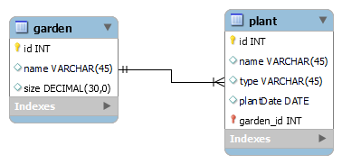
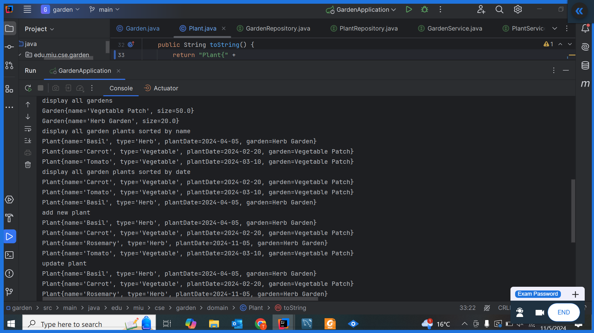
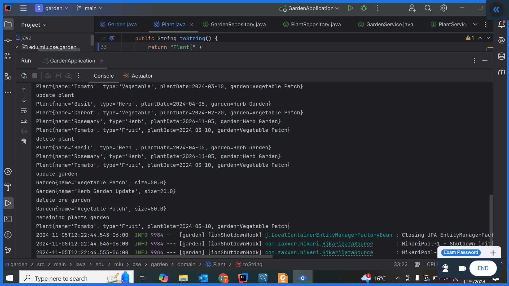

## requirements
### garden
- attribute : id, name, size
- operation : CRUD, retrieve and display all plants, sorted by name and plant date.
### plant
attribut : id, name, type, plantDate
- operation : CRUD

